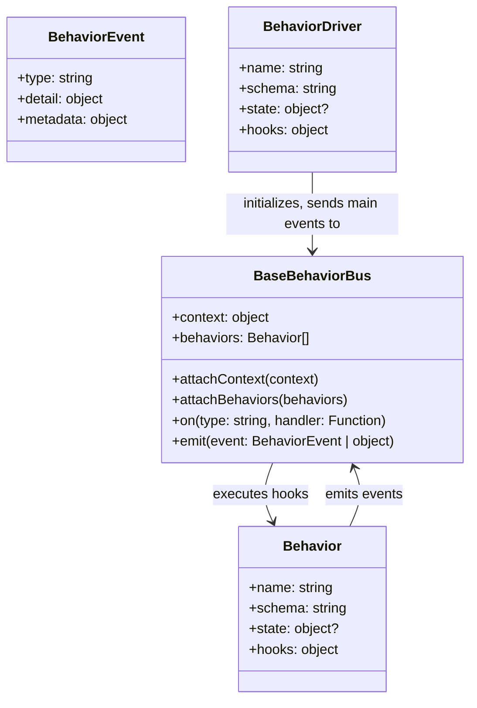

# 🧩 [`abx-spec-behaviors`](https://archivebox.gitbook.io/abx-spec-behaviors) @ `v0.1.0` [DRAFT]

>  &nbsp; &nbsp; &nbsp; &nbsp;  &nbsp; &nbsp; &nbsp; &nbsp;  &nbsp; &nbsp; &nbsp; &nbsp;  &nbsp; &nbsp; &nbsp; &nbsp;  &nbsp; &nbsp; &nbsp; &nbsp;   

Spec for browser automation scripts to be shared between scraping/crawling/archiving tools.  
Building on the ideas from [`browsertrix-behaviors`](https://github.com/webrecorder/browsertrix-behaviors).

> 🤔 To scrape Reddit using `playwright` today, you'd probably Google `reddit playwright`, attempt to copy/paste some examples, and likely end up writing your own script to scroll pages, wait for lazy loading, expand comments, extract JSON, etc.  
>  
> 🚀 *Instead*, imagine if a simple Github search for `reddit topic:abx-behavior` yielded hundreds of community-mainted, spec-compliant `reddit` scripts for many different tasks, ready to run with any driver library (`puppeteer`/`playwright`/`webdriver`/etc.).

This spec defines a common format for user scripts that allows them to be run by many different browser automation driver libraries.
```javascript
// example of a simple Behavior that could be shared via Github/Gist
const ScrollDownBehavior = {
    name: 'ScrollDownBehavior',
    schema: 'BehaviorSpec@0.1.0',
    version: '0.9.9',
    description: 'Scroll the page down after it loads to trigger any lazy-loaded content, then scroll back up.',
    documentation: 'https://github.com/example/ScrollDownBehavior',
    hooks: {
        PAGE_LOAD: async (event, BehaviorBus, window) => {
            // scroll the page down by 1400px
            window.scrollTo({top: 1400, behavior: 'smooth'})
            // wait 2s, then scroll back up
            setTimeout(() => {
                window.scrollTo({top: 0, behavior: 'smooth'})
                BehaviorBus.emit({type: 'SCROLL_COMPLETE'})
            }, 2000)
        },
    },
}

// to use this Behavior in a crawl, load it and fire the PAGE_LOAD once you have `window` ready:
BehaviorBus.attachBehaviors([ScrollDownBehavior])
BehaviorBus.attachContext(window); 
BehiavorBus.emit('PAGE_LOAD')
```

🎭 It's one step up from TamperMonkey/Greasemonkey user scripts, with the ability to define event listeners for normal `window` DOM events, but also puppeteer lifecycle events, service worker / browser extension events, and other events that your crawling environment may choose to dispatch (see below for examples).

**Dependencies:** *None*, uses JS standard library `EventTarget` system which is native in both browser and Node.  
**Easy to Use:** all-in-one script, just import [`behaviors.js`](https://github.com/ArchiveBox/abx-spec-behaviors/blob/main/src/behaviors.js), &lt; 500 lines total

> [!IMPORTANT]  
> This is an early-stage proposal, we're seeking feedback from tool makers who build with browser automation!

## Goals

> To create an inter-operable spec for browser scripts that many scraping and digital archiving projects can share.

Everyone scraping today has to hide the same popups / block the same ads / log into the same sites / get around the same CAPTCHAs / expand the same comments, leading to a massive duplication of effort. Most projects manually write their own scripts for every site they want to scrape, and there's no good way to *share* those scripts consistently.

[Greasemonkey](https://en.wikipedia.org/wiki/Greasemonkey) grew into a huge [community](https://github.com/awesome-scripts/awesome-userscripts) because their very [very simple spec](https://hayageek.com/greasemonkey-tutorial/#hello-world) allows anyone to quickly write a function and [share it with others](https://greasyfork.org/en), even if they're using a different extension to run it (e.g. [Tampermonkey](https://www.tampermonkey.net/), [ViolentMonkey](https://violentmonkey.github.io/), FireBug, etc.).  
  
This `Behavior` spec proposal aims to do something similar, but for slightly more powerful user scripts that can leverage `puppeteer`, `playwright`, and other crawling & scraping driver APIs.

#### Use Cases

No one wants to maintain all the user scripts needed effectively crawl millions of different websites alone.  
Here are some examples of things that could be implemented as behaviors and shared between these communities:

- `scroll down to load infiniscroll content`
- `expand/unroll reddit/twitter comment threads automatically`
- `auto-solve CAPTCHAs`
- `log into a site using some saved credentils`
- `dismiss modals / cookie consent popups / privacy policies`
- `block ads requests / remove ads elements from page`
- `extract youtube videos/audio/subtitles to mp4/mp3/sub files`
- `export discovered outlink URLs to a Google Sheet`
- `send some page content to an LLM with a prompt and store the response`
- and more...

We're aiming to foster easier collaboration & sharing of browser automation snippets between communities like these:

#### Toolmakers
- https://ArchiveBox.io
- https://webrecorder.net (https://github.com/webrecorder/browsertrix-behaviors)
- https://archive.org
- https://conifer.rhizome.org
- https://linkwarden.app
- https://github.com/gildas-lormeau/singlefile
- https://github.com/bellingcat/auto-archiver
- https://docs.anthropic.com/en/docs/build-with-claude/computer-use
- https://docs.anthropic.com/en/docs/build-with-claude/tool-use / and other AI function calling systems

#### Industry
- https://reset.tech
- https://mediaforcellc.com
- https://www.starlinglab.org

> *Want to collaborate? Join us on the [ArchiveBox Zulip](https://zulip.archivebox.io/#narrow/stream/163-ideas/topic/new.20Behavior.20specification.20for.20community.20ecosystem.20plugins) or [WebRecorder Discord](https://discord.com/channels/895426029194207262/1303099855262187715/1303955724442931202), or [open an issue](https://github.com/ArchiveBox/behaviors-spec).*


## Quickstart

```bash
git clone https://github.com/ArchiveBox/behaviors-spec && cd behaviors-spec
npm install                                   # only needed to run examples

node src/example_puppeteer_driver.js
```

---

**Key Concepts:**

- [`Behavior`](#behavior): a plugin that implements some event listener hook methods
- [`BehaviorBus`](#behaviorbus): an event bus that coordinates emitting events and firing matching listeners
- [`BehaviorEvent`](#behaviorevent): an event `{type: 'PAGE_LOAD', url}` that goes through a `BehaviorBus`
- [`BehaviorDriver`](#behaviordriver): navigates to URLs, sets up `BehaviorBus` instances for browser/puppeteer/extensions, registers all the `Behavior` event listeners, and fires main crawl lifecycle events 



## `Behavior`

Behaviors are what this whole proposal is about. A `Behavior` is sharable bundle of hook methods that will run in the context of a page during crawling.

A simple `Behavior` like `HideModalsBehavior` might only provide a single `browser: PAGE_LOAD` that deletes `div.modal` elements after page load is complete.

A more complex behavior like `ExpandComments` might provide a `browser: PAGE_LOAD` hook that expands `<details>` elements in the body, but it could also provide an extra `puppeteer: PAGE_LOAD` hook that will run if you have puppeteer available. The Behavior is usable whether you're automating via browser extension or headless browser, because you can run it as long as you have `window`, but when puppeter's extra powers (e.g. `$$('pierce/...`) are available, the `Behvior` provides extra functionality that makes it work across shadow DOMs and inside `<iframe>`s.

If we all agree to use a minimal shared event spec like this then can we all share the benefit of community-maintained pools of "Behaviors" organically on Github. You can build a fancy app store style interface in your own tool and just populate it with all Github repos tagged with `abx-spec-behaviors` + `yourtoolname`. Different crawling tools can implement the hooks you care about, dispatch a few events on `BehaviorBus` during their crawling lifecycle, and `BehaviorBus` runs the `Behaviors` you want it to. You get opt-in plugin functionality for free based on the events you fire, and you don't have to modify your own tool at all. 

> [!TIP]
> Almost all `Behavior`s will only need a single `PAGE_LOAD` or `PAGE_CAPTURE` method to implement their functionality (under the `window` context). Hooks for other contexts are only to be used when a `Behavior` author wants to provide some extra bonus functionality for specific contexts (e.g. `puppeteer`, `serviceworker`, etc.).

**This Spec is A-La-Carte**

You can be minimalist and only fire `PAGE_LOAD` if you don't want your crawling tool offer a big surface area to `Behavior` scripts, or if you want all the functionality plugins have to offer, you can fire all the lifcycle events like `PAGE_SETUP` `PAGE_CAPTURE` `PAGE_CLOSE`, etc.

Not all the crawling tools provide all the same APIs, so `hooks` within a `Behavior` plugin are organized by the context they depend on.
We provide a `BehaviorBus` available across all contexts, and your tool can dispatch the events it cares about in each.

Your tool can choose what `hooks` it would like to load within a `Behavior` based on what execution contexts you want to provide to the plugins (e.g. `browser` means you can run JS inside the context of a browser with `globalThis == window`, `puppeteer` means you have puppeteer available with `page` and `browser`.


### `Behavior` Usage

`Behaviors` are used as part of a crawl process implemented by a [`BehaviorDriver`](#behaviordriver):
```javascript
await crawlInBrowser('https://example.com', [ExtractArticleText, DiscoverOutlinks])
// OR
await crawlInPuppeteer('https://example.com', [ExtractArticleText, DiscoverOutlinks])
```

### `Behavior` Examples

```javascript
class ExtractArticleText {
    name: 'ExtractArticleText',
    schema: 'BehaviorSchema@0.1.0',
    hooks: {
        window: {
            PAGE_CAPTURE: async (event, BehaviorBus, window) => {
                 const article_text = window.document.body.innerText
                 BehaviorBus.emit({type: 'DISCOVERED_TEXT', selector: 'body', text: article_text})
                 BehaviorBus.emit({type: 'FS_WRITE_FILE', path: 'article.txt', content: article_text})
            },
        },
    },
}
```
```javascript
const DiscoverOutlinks = {
    name: 'DiscoverOutlinks',
    version: '0.1.9',
    schema: 'BehaviorSchema@0.1.0',
    license: 'MIT',
    author: 'ArchiveBox',
    description: 'Find all the outgoing <a href> and <iframe> URLs on the page',
    documentation: 'https://github.com/ArchiveBox/behaviors-spec#example-behavior',

    findOutlinkURLs: (elem) => {
        return [...elem.querySelectorAll('a[href], iframe[src]')].map(a => a.href || a.src),
    },

    hooks: {
        window: {
            // PAGE_SETUP: ...
            // PAGE_LOAD: ...
            PAGE_CAPTURE: async (event, BehaviorBus, window) => {
                for (const url of DiscoverOutlinks.findOutlinkURLs(window.document.body)) {
                    BehaviorBus.emit({type: 'DISCOVERED_OUTLINK', url})
                    BehaviorBus.emit({type: 'FS_WRITE_FILE', path: 'outlinks.txt', mode: 'append', content: url + '\n'})
                }
            },
         // PAGE_CAPTURE_COMPLETE: ...
        },
     // cdp: ...
     // webdriver: ...
     // serviceworker: ...
     // puppeteer: ...
     // playwright: ...
     // archivebox: ...
     // browsertrix: ...
     // ... any other BehaviorBus: {hooks} the behavior defines ...
    },
}
```

To see more example behaviors, check out: [`src/example_behaviors.js`](https://github.com/ArchiveBox/behaviors-spec/blob/main/src/example_behaviors.js) and [`behaviors/`](https://github.com/ArchiveBox/abx-spec-behaviors/tree/main/behaviors).


<br/>

### `Behavior` Composition

If you want to have one behavior depend on the output of another, the second behavior can simply listen for the relevant events emitted by the first one.  

```javascript
const ScreenshotBehavior = {
    ...
    puppeteer: {
        PAGE_CAPTURE: async (event, BehaviorBus, page) => {
            await page.screenshot(...);
            BehaviorBus.emit({type: 'EXTRACTED_SCREENSHOT', path: 'screenshot.png', ...})
        },
    }
}

const SomeBehaviorThatDependsOnScreenshot = {
    ...
    puppeteer: {
        EXTRACTED_SCREENSHOT: async (event, BehaviorBus, page) => {
            // this fires when any earlier behavior emits EXTRACTED_SCREENSHOT
            console.log('do something with the screenshot here...', event.path)
        }
    }
}
```

No API is provided for Behaviors to directly depend on other specific behaviors (e.g. `depends_on: ['SomeOtherBehavior']`), in general trying to do so is discouraged.  

By listening for a more generic event, it allows the users to swap out the `ScreenshotBehavior` for a different screenshot implementation, as long as it emits the same `EXTRACTED_SCREENSHOT` event.  
This approach of "loose coupling" / [duck typing](https://en.wikipedia.org/wiki/Duck_typing) means the only hard contract between behaviors are the `EVENT_NAME` + args they emit/listen for.  
This is based on the UNIX philosophy of `Expect the output of every program to become the input to another, as yet unknown, program.`.

---


<br/>

## `BehaviorBus`

`BehaviorBus` extends [`EventTarget`](https://developer.mozilla.org/en-US/docs/Web/API/EventTarget) and is a simple event bus that can consume/emit events + dispatch event listener callbacks.  
`BehaviorEvent` extends [`CustomEvent`](https://developer.mozilla.org/en-US/docs/Web/API/CustomEvent), both are based on the normal DOM event system / standard types and require no extra libraries.

### `BehaviorBus` Usage

A new `BehaviorBus` is set up for each context by the `BehaviorDriver` as soon as page loading starts.
```javascript
window.location.href = 'https://example.com'
window.BehaviorBus = new WindowBehaviorBus(window.BEHAVIORS, window);
```

```javascript
// these methods are all the same, they are just aliases of each other
BehaviorBus.dispatch(event) == BehaviorBus.dispatchEvent(event) == BehaviorBus.emit(event)
BehaviorBus.addEventListener(event_name, handler, options) == BehaviorBus.on(event_name, handler, options)
```

See `src/event_bus.js` for the full implementation.

### `BehaviorBus` Examples

```javascript
global.BehaviorBus = new WindowBehaviorBus(window.BEHAVIORS, window);
BehaviorBus.attachBehaviors([PuppeteerCrawlDriver])
BehaviorBus.attachBehaviors(window.BEHAVIORS)
BehaviorBus.attachContext(window)
```

Event listeners attached by `BehaviorBus.attachBehaviors([...])` look like this:
```javascript
// example: listen for PAGE_LOAD event, look for URLs on the page, and emit a DISCOVERED_URL event for each
BehaviorBus.on('PAGE_LOAD', async (event, BehaviorBus, window) => {
    for (const elem of window.document.querySelector('a[href]')) {
        BehaviorBus.emit({type: 'DISCOVERED_OUTLINK', url: elem.href})
    }
})
```

```javascript
// example: listen for *all* events on the BehaviorBus and log them to console
BehaviorBus.on('*', (event, BehaviorBus, window) => {
    console.log(`[window] -> [LOG] : ${JSON.stringify(event)}`);
}, {behavior_name: BehaviorBus.name});
```

```javascript
// dispatching an Event
BehaviorBus.emit({type: 'DISCOVERED_OUTLINK', url})
// OR
BehaviorBus.emit(new BehaviorEvent('DISCOVERED_OUTLINK', {url}))
```


### How `BehaviorBus` instances get connected

<details><summary><code>BehaviorBus</code> instances are typically linked together so that events emitted by one get sent to all the others.</summary>

<br/>
  
Drivers set this up before a page is first loaded so that behavior code running in any context can coordinate
across all the contexts available to the driver.  e.g. a behavior hook running inside a page on <code>WindowBehaviorBus</code> can
emit an event that triggers a hook it defined on the <code>PuppeteerBehaviorBus</code>.  
This means <code>BehaviorEvent</code>s can "jailbreak" out of a page's context and propagate up to a parent puppeteer context, and vice versa.

<pre lang="javascript"><code>// set up forwarding from WindowBehaviorBus -> PuppeteerBehaviorBus
await page.exposeFunction('dispatchEventToPuppeteerBus', (event) => PuppeteerBehaviorBus.emit(event));
await page.evaluate(() => {
    window.BehaviorBus.addEventListener('*', (event) => {
        // if the event didn't come from the PuppeteerBehaviorBus already, forward it to them
        if (!event.detail.metadata.path.includes('PuppeteerBehaviorBus')) {
            console.log(`[window] -> [puppeteer]: ${JSON.stringify(event)}`);
            window.dispatchEventToPuppeteerBus(event.detail)
        }
    }, {behavior_name: 'WindowBusToPuppeteerBusForwarder'});
});
</code></pre>
<pre lang="javascript"><code>// set up forwarding from PuppeteerBehaviorBus -> WindowBehaviorBus
PuppeteerBehaviorBus.addEventListener('*', (event) => {
    event = new BehaviorEvent(event);

    // if the event didn't come from the WindowBehaviorBus already, forward it to them
    if (!event.detail.metadata.path.includes('WindowBehaviorBus')) {
        console.log(`[puppeteer] -> [window]: ${JSON.stringify(event.detail)}`);
        page.evaluate((event) => {
            event = new BehaviorEvent(JSON.parse(event));
            window.BehaviorBus.emit(event);
        }, JSON.stringify(event.detail));
    }
}, {behavior_name: 'PuppeteerBusToWindowBusForwarder'});
</code></pre>

For the full linking code, see here:

<ul>
<li><a href="https://github.com/ArchiveBox/behaviors-spec/blob/main/src/example_puppeteer_driver.js"><code>src/example_puppeteer_driver.js: linkPuppeteerBusToWindowBus(...)</code></a></li>
<li><a href="https://github.com/ArchiveBox/behaviors-spec/blob/main/src/example_puppeteer_driver.js"><code>src/example_puppeteer_driver.js: linkPuppeteerBusToServiceWorkerBus(...)</code></a></li>
</ul>

</details>

<br/>

---

<br/>

## `BehaviorEvent`

`BehaviorEvent` extends [`CustomEvent`](https://developer.mozilla.org/en-US/docs/Web/API/CustomEvent) which is the standard `Event` type that browsers use for all DOM events.

```javascript
const event = new BehaviorEvent(
    'PAGE_LOAD',
    {url},
    {path: ['PuppeteerBehaviorBus']},
)

console.log(event.detail)
{
    type: 'PAGE_LOAD',         // must be all-caps [A-Z_]+
    metadata: {                // added automatically by BehaviorBus
        id: uuid4(),
        timestamp: Date.now(),
        path: ['PuppeteerBehaviorBus', 'WindowBehaviorBus'],
    }
    ...detail,                 // any extra data you include e.g. {url}
}
```


### `BehaviorEvent` Usage

Events can be dispatched by calling `BehaviorBus.emit({type: 'EVENT_TYPE', ...})` from any context:
```javascript
// example: dispatch an event to the event bus immediately
BehaviorBus.emit({type: 'PAGE_LOAD', url: window.location.href})

// equivalent:
BehaviorBus.emit(new BehaviorEvent('PAGE_LOAD', {url: window.location.href}))
```

<br/>

### Common Event Types

Each event should include relevant context in its payload such as timestamps, URLs, element selectors, file paths, etc. However events can contain plain JSON-serilizable values only, don't put raw DOM element handles into events.

Event type names follow these principles:
1. Use existing DOM event names where applicable
2. Use NOUN + present tense VERB pattern for events typically fired by driver, that hooks react to (e.g., `PAGE_SETUP`, `PAGE_LOAD`, `PAGE_CHANGE`, `PAGE_CLOSE`)
3. Use past tense VERB + NOUN pattern e.g. `DISCOVERED_VIDEO` or `EXTRACTED_VIDEO` when a Behavior is reporting a content discovery or extraction it made
4. Include `_COMPLETE` suffix for events that report the ending of a process
5. Include `_ERROR` suffix for error variants of events

#### Page Lifecycle Events

A driver striving to be feature-complete should emit all these lifecycle events to the `BehaviorBus` at the correct times, however it is not required for it to emit all of them.  
A simple driver may only emit `PAGE_LOAD` for example, but it would miss out on any more complex `Behavior` plugin functionality that might depended on `PAGE_SETUP`.

- `PAGE_SETUP`: Fired when page navigation starts but before DOM is ready (equivalent to `document.readystate = 'loading'`)
- `DOM_CONTENT_LOADED`: Fired when initial HTML is loaded and parsed (maps directly to DOM event)
- `PAGE_LOAD`: Fired when page has finished loading including images/styles (equivalent to `window.onload`)
- `PAGE_IDLE`: Fired when page has been idle with no network activity for 2+ seconds
- `PAGE_CAPTURE`: Fired when it's time to extract content/take snapshots of the page
- `PAGE_CAPTURE_COMPLETE`: Fired when all capture/extraction operations are finished
- `PAGE_BEFORE_UNLOAD`: Fired before page is about to be unloaded (maps to `window.onbeforeunload`)
- `PAGE_UNLOAD`: Fired when page is being unloaded (maps to `window.onunload`)

#### File System Events

A driver that expects `Behaviors` (e.g. `ExtractArticleText`) to output files to the filesystem
needs to listen for these events and provide implementations for them. e.g. if you're in node
you could handle `FS_WRITE_FILE` by calling `fs.writeFileSync(event.path, event.content)`, but
if you are running `Behaviors` from a browser you may need to use OPFS instead.

- **`FS_WRITE_FILE`:** Fired when a `Behavior` is requesting to write a file
- `FS_MAKE_DIR`: Fired when requesting to create a directory (optional)
- `FS_DELETE_FILE`: Fired when requesting to delete a file (optional)
- `FS_REMOVE_DIR`: Fired when requesting to remove a directory (optional)

#### AI/LLM/External API Events

A driver could choose to implement these if it wants to allow `Behaviors` to use LLM APIs to do things. Behaviors should do LLM logic using these events, as then they be used with any LLM backend of the driver's choosing. Behaviors then won't have to hardcode their own internal logic to make calls to Open AI or Anthropic's APIs, and it makes it easier to swap in and out models depending on context.

- `LLM_REQUEST`: Fired when a Behavior wants to call whatever AI/LLM API might be provided by the driver
- `LLM_REQUEST_COMPLET`: Fired when AI/LLM processing completes
- `LLM_REQUEST_ERROR`: Fired when AI/LLM processing fails
- `... you coordinate other custom event types for your own private APIs too ...`

#### Content Discovery Events

Behaviors working with these types of content should emit these events when they discover relevant content on the page.
You might have a `Behavior` that scans `<a href>` links on the page, have it emit `DISCOVERED_OUTLINK` for each one it finds.
Then if your driver wants to do recursiving crawling, it could listen for `DISCOVERED_OUTLINK` events on the `BehaviorBus`, ]
and add the URLs any `Behavior` discovers to its crawl queue.

- `DISCOVERED_OUTLINK`: Fired when a new URL is found that could be crawled
- `DISCOVERED_IMAGE`: Fired when an image resource is found
- `DISCOVERED_VIDEO`: Fired when a video resource is found
- `DISCOVERED_AUDIO`: Fired when an audio resource is found
- `DISCOVERED_DOWNLOAD`: Fired when a download link (ZIP/PDF/DOC/EXE/etc.) is found
- `DISCOVERED_FEED`: Fired when an RSS/Atom feed is found
- `DISCOVERED_API`: Fired when an API endpoint is found
- `DISCOVERED_FORM`: Fired when an interactive form is found
- `DISCOVERED_TEXT`: Fired when significant text content is found

#### Content Extraction Events

When content has been extracted out of a page and saved as a file somewhere.

- `EXTRACTED_METADATA`: Fired when page metadata has been collected
- `EXTRACTED_SCREENSHOT`: Fired when a screenshot has been taken
- `EXTRACTED_PDF`: Fired when a PDF has been generated
- `EXTRACTED_WARC`: Fired when an archive file has been created

#### Human Behavior Emulation Events

Behaviors can choose to emit these when emulating user stpes on a page / listen for them being emitted from other behaviors.  
These events don't do anything on their own and are not required, it's just recommended to announce these to make it easier for other
plugins to listen for changes and coordinate their own logic.

- `SCROLL`: Announce whenver a page's croll position is changed
- `SCROLL_COMPLETE`: Fired when a sequence of scroll operations is finished
- `FORM_SUBMIT`: Fired when attempting to submit a form
- `FORM_SUBMIT_COMPLETE`: Fired when form submission is finished
- `CLICK`: Fired when programmatically clicking an element
- `HOVER`: Fired when programmatically hovering over an element
- `INPUT`: Fired when programmatically entering text into a field
- `INPUT_COMPLETE`: Fired when a sequence of text input operations is finished
- `DIALOG_OPEN`: Fired when a modal/dialog opens
- `DIALOG_CLOSE`: Fired when a modal/dialog closes

<br/>


---

<br/>

## `BehaviorDriver`

`BehaviorDriver`s are just like `Behavior`s in that they implement some event listeners.  
Drivers are designed to implement the core events used by all the other behaviors as
their "standard library" of utilities, e.g. filesystem IO, adding to crawl queue, etc...

Drivers can maintain some persistent state across crawl as well (just like `Behaviors`).
```javascript
const BrowserCrawlDriver = {
    name: 'BrowserCrawlDriver',
    schema: 'BehaviorDriverSchema@0.1.0',

    state: {
        output_files: [],
        output_urls: [],
        output_texts: [],
    },

    hooks: {
        browser: {
            FS_WRITE_FILE: async (event, BehaviorBus, page) => {
                const opfsRoot = await window.navigator.storage.getDirectory();
                const fileHandle = await opfsRoot.getFileHandle("fast", { create: true });
                const accessHandle = await fileHandle.createSyncAccessHandle();
                accessHandle.write(content); accessHandle.flush(); accessHandle.close();
                BrowserCrawlDriver.state.output_files.push({path, accessHandle});
            },
            DISCOVERED_OUTLINK: async (event, BehaviorBus, page) => {
                BrowserCrawlDriver.state.output_urls.push(event.url);
            },
            DISCOVERED_TEXT: async (event, BehaviorBus, page) => {
                BrowserCrawlDriver.state.output_texts.push(event.text);
            },
            // DISCOVERED_MEDIA: async (event, BehaviorBus, page) => {
            //     BehaviorBus.emit({type: 'CALL_EXTERNAL_TOOL', bin: 'yt-dlp', cmd: ['yt-dlp', event.url]})
            // })
        },
    },
}
```


To see how Behaviors would be run by different tools, check out the example drivers:

- [`src/example_puppeteer_driver.js`](https://github.com/ArchiveBox/behaviors-spec/blob/main/src/example_puppeteer_driver.js)
- [`src/example_browser_driver.js`](https://github.com/ArchiveBox/behaviors-spec/blob/main/src/example_browser_driver.js)
- [`src/example_browsertrix_driver.js`](https://github.com/ArchiveBox/behaviors-spec/blob/main/src/example_browsertrix_driver.js)
- [`src/example_archivebox_driver.js`](https://github.com/ArchiveBox/behaviors-spec/blob/main/src/)

<br/>

### `BehaviorDriver` Usage

Here's how you can test a driver:
```javascript
window.location.href = 'https://example.com'

// driver is initialized right after navigation starts, before page is loaded
const BehaviorBus = new WindowBehaviorBus([BrowserCrawlDriver, ...window.BEHAVIORS], window);

// you can test the driver implementation by firing one of the events it handles
BehaviorBus.emit({type: 'FS_WRITE_FILE', path: 'text.txt', content: 'testing writing to filesystsem using drivers FS_WRITE_FILE implementation'})
```

### `BehaviorDriver` Example Output

Here's the example output from a full puppeteer crawl run with all the example behaviors:
```javascript
$ cd src/
$ node ./example_puppeteer_driver.js
// loading src/behavior_bus.js
[window] loaded window.BehaviorEvent
[window] loaded window.WindowBehaviorBus
[window] loaded window.PuppeteerBehaviorBus
[window] loaded window.ServiceWorkerBehaviorBus

// loading src/example_behaviors.js
[window] loaded window.DiscoverOutlinksBehavior
[window] loaded window.ExtractArticleTextBehavior
[window] loaded window.ExpandCommentsBehavior
[window] loaded window.BEHAVIORS

// setting up BehaviorBus instances
[puppeteer] initialized page.BehaviorBus    = PuppeteerBehaviorBus()
[window]    initialized window.BehaviorBus  = WindowBehaviorBus()
[puppeteer] linked PuppeteerBehaviorBus() <-> WindowBehaviorBus()

[puppeteer] -> [LOG] : {"type":"PAGE_SETUP","metadata":{"id":"af16f6ea-a17b-4339-88ec-040262cdeaa5","timestamp":1730956441325,"path":["PuppeteerCrawlDriver","PuppeteerBehaviorBus"]},"url":"https://example.com"}
[puppeteer] -> [window]: {"type":"PAGE_SETUP","metadata":{"id":"af16f6ea-a17b-4339-88ec-040262cdeaa5","timestamp":1730956441325,"path":["PuppeteerCrawlDriver","PuppeteerBehaviorBus","PuppeteerBusToWindowBusForwarder"]},"url":"https://example.com"}
[window] -> [LOG] : {"type":"PAGE_SETUP","metadata":{"id":"af16f6ea-a17b-4339-88ec-040262cdeaa5","timestamp":1730956441325,"path":["PuppeteerCrawlDriver","PuppeteerBehaviorBus","PuppeteerBusToWindowBusForwarder","WindowBehaviorBus"]},"url":"https://example.com"}

[puppeteer] -> [DiscoverOutlinksBehavior] 🔧 Discovering outlinks by watching for requests ending in .html

[puppeteer] -> [LOG] : {"type":"PAGE_LOAD","metadata":{"id":"91ef07af-21cd-4a78-8446-d4f5cae2fb3d","timestamp":1730956441350,"path":["PuppeteerCrawlDriver","PuppeteerBehaviorBus"]},"url":"https://example.com"}
[puppeteer] -> [window]: {"type":"PAGE_LOAD","metadata":{"id":"91ef07af-21cd-4a78-8446-d4f5cae2fb3d","timestamp":1730956441350,"path":["PuppeteerCrawlDriver","PuppeteerBehaviorBus","PuppeteerBusToWindowBusForwarder"]},"url":"https://example.com"}
[window] -> [LOG] : {"type":"PAGE_LOAD","metadata":{"id":"91ef07af-21cd-4a78-8446-d4f5cae2fb3d","timestamp":1730956441350,"path":["PuppeteerCrawlDriver","PuppeteerBehaviorBus","PuppeteerBusToWindowBusForwarder","WindowBehaviorBus"]},"url":"https://example.com"}

[puppeteer] -> [ExpandCommentsBehavior] 💬 Expanding comments...
[window] -> [ExpandCommentsBehavior] 💬 Expanding comments...

[puppeteer] -> [LOG] : {"type":"PAGE_CAPTURE","metadata":{"id":"f967c174-70a6-4262-af3e-20209a7a03fb","timestamp":1730956446352,"path":["PuppeteerCrawlDriver","PuppeteerBehaviorBus"]},"url":"https://example.com"}
[puppeteer] -> [window]: {"type":"PAGE_CAPTURE","metadata":{"id":"f967c174-70a6-4262-af3e-20209a7a03fb","timestamp":1730956446352,"path":["PuppeteerCrawlDriver","PuppeteerBehaviorBus","PuppeteerBusToWindowBusForwarder"]},"url":"https://example.com"}
[window] -> [LOG] : {"type":"PAGE_CAPTURE","metadata":{"id":"f967c174-70a6-4262-af3e-20209a7a03fb","timestamp":1730956446352,"path":["PuppeteerCrawlDriver","PuppeteerBehaviorBus","PuppeteerBusToWindowBusForwarder","WindowBehaviorBus"]},"url":"https://example.com"}

[window] -> [DiscoverOutlinksBehavior] 🔍 Discovering outlinks...
[window] -> [ExtractArticleTextBehavior] 📄 Extracting article text...
[window] -> [DiscoverOutlinksBehavior] ➕ Found a new outlink to add to crawl! https://www.iana.org/domains/example

[window] -> [LOG] : {"type":"DISCOVERED_OUTLINK","metadata":{"id":"9cf9d614-20e6-47e9-8564-1768c1f4f8bf","timestamp":1730956446354,"path":["WindowBehaviorBus"]},"url":"https://www.iana.org/domains/example","elem":{}}
[window] -> [LOG] : {"type":"FS_WRITE_FILE","metadata":{"id":"8a2e0164-c7f0-43a1-b415-4e6b10f080f1","timestamp":1730956446355,"path":["WindowBehaviorBus"]},"path":"body_text.txt","content":"Example Domain\n\nThis domain is for use in illustrative examples in documents. You may use this domain in literature without prior coordination or asking for permission.\n\nMore information..."}
[window] -> [LOG] : {"type":"DISCOVERED_TEXT","metadata":{"id":"9fb09d49-cce9-4f16-98fc-daaf7df34e26","timestamp":1730956446355,"path":["WindowBehaviorBus"]},"selector":"body","text":"Example Domain\n\nThis domain is for use in illustrative examples in documents. You may use this domain in literature without prior coordination or asking for permission.\n\nMore information..."}

[puppeteer] -> [LOG] : {"type":"PAGE_CAPTURE_COMPLETE","metadata":{"id":"c5bed695-db37-43b2-8bc5-eab058642c75","timestamp":1730956451353,"path":["PuppeteerCrawlDriver","PuppeteerBehaviorBus"]},"url":"https://example.com"}
[puppeteer] -> [window]: {"type":"PAGE_CAPTURE_COMPLETE","metadata":{"id":"c5bed695-db37-43b2-8bc5-eab058642c75","timestamp":1730956451353,"path":["PuppeteerCrawlDriver","PuppeteerBehaviorBus","PuppeteerBusToWindowBusForwarder"]},"url":"https://example.com"}
[window] -> [LOG] : {"type":"PAGE_CAPTURE_COMPLETE","metadata":{"id":"c5bed695-db37-43b2-8bc5-eab058642c75","timestamp":1730956451353,"path":["PuppeteerCrawlDriver","PuppeteerBehaviorBus","PuppeteerBusToWindowBusForwarder","WindowBehaviorBus"]},"url":"https://example.com"}
```

<br/>


---

<br/>

## Further Reading

- Proposal Discussions: [ArchiveBox Zulip](https://zulip.archivebox.io/#narrow/stream/163-ideas/topic/new.20Behavior.20specification.20for.20community.20ecosystem.20plugins) and [WebRecorder Discord](https://discord.com/channels/895426029194207262/1303099855262187715/1303955724442931202)
- Development Accouncement: https://docs.sweeting.me/s/archivebox-plugin-ecosystem-announcement
- Browsertrix's existing behaviors system: https://github.com/webrecorder/browsertrix-behaviors
- Built on: https://developer.mozilla.org/en-US/docs/Web/API/EventTarget
- Inspired by: https://pluggy.readthedocs.io/en/stable/index.html
